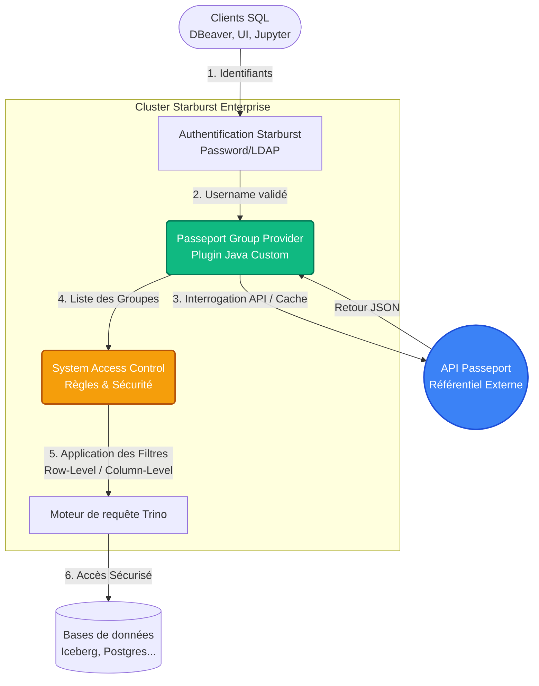
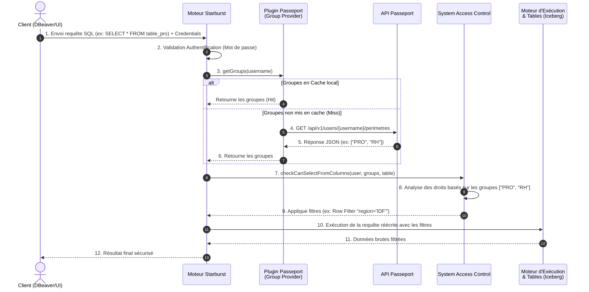

# Architecture : Plugin Passeport pour Starburst Enterprise

Ce document décrit l'architecture finale et le flux d'intégration du plugin `passeport-group-provider` (version 2.0.0) au sein de l'environnement Starburst Enterprise sur AWS EKS (`fr-ai-workshop`).

## 1. Vue d'Ensemble de l'Architecture (Overview)

Ce diagramme illustre le parcours de la donnée depuis la connexion de l'utilisateur jusqu'à l'accès physique aux tables. Il met en évidence la séparation des responsabilités entre l'authentification (Starburst), la résolution des groupes (notre plugin via l'API Passeport), et l'application des filtres de sécurité sur les données (System Access Control).

## 2. Diagramme de Séquence (Exécution d'une Requête et Filtrage)

Ce diagramme de séquence se concentre spécifiquement sur le cycle de vie d'une requête SQL : de l'authentification jusqu'à l'application des filtres (Row-Level et Column-Level) sur les tables, en passant par l'interrogation de l'API Passeport.

## Composants Clés

### 1. Livraison et Déploiement (GitOps)
* Le plugin est développé en **Java 25** pour être compatible avec l'API Trino 482.
* La livraison se fait via des **GitHub Releases**. Les binaires ne sont pas stockés dans l'arbre source Git.
* Sur AWS EKS, un `initContainer` télécharge l'archive au démarrage du pod `coordinator` via `wget`, garantissant un déploiement immuable et sans dépendance à S3.

### 2. Le Plugin : Group Provider
* Le plugin s'enregistre auprès de Starburst sous le nom `passeport` (`group-provider.name=passeport`).
* Il a pour rôle exclusif de résoudre l'identité (à quels groupes appartient l'utilisateur). La vérification du mot de passe reste gérée par Starburst.

### 3. Résilience et Performances (No JDBC)
* **API REST** : L'ancienne connexion directe à la base de données PostgreSQL a été remplacée par des appels à une API REST d'entreprise.
* **Cache en mémoire** : Pour éviter d'introduire de la latence lors de la planification des requêtes SQL, les périmètres sont mis en cache.
* **Tolérance aux pannes** : En cas d'indisponibilité de l'API Passeport, les exceptions sont attrapées (`try/catch`) et un ensemble vide est retourné, évitant ainsi le crash (Erreur 500) du serveur Starburst.